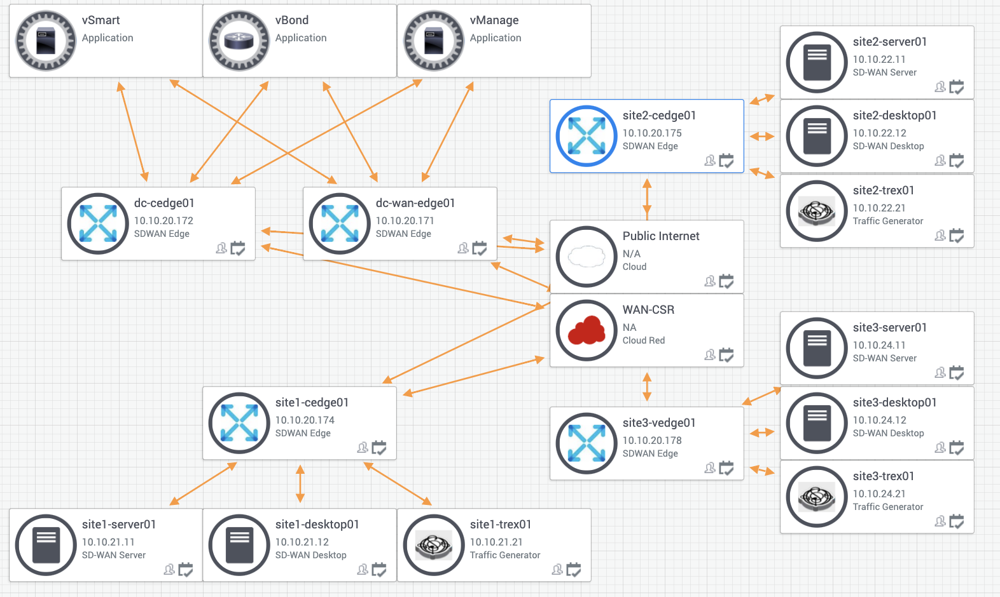
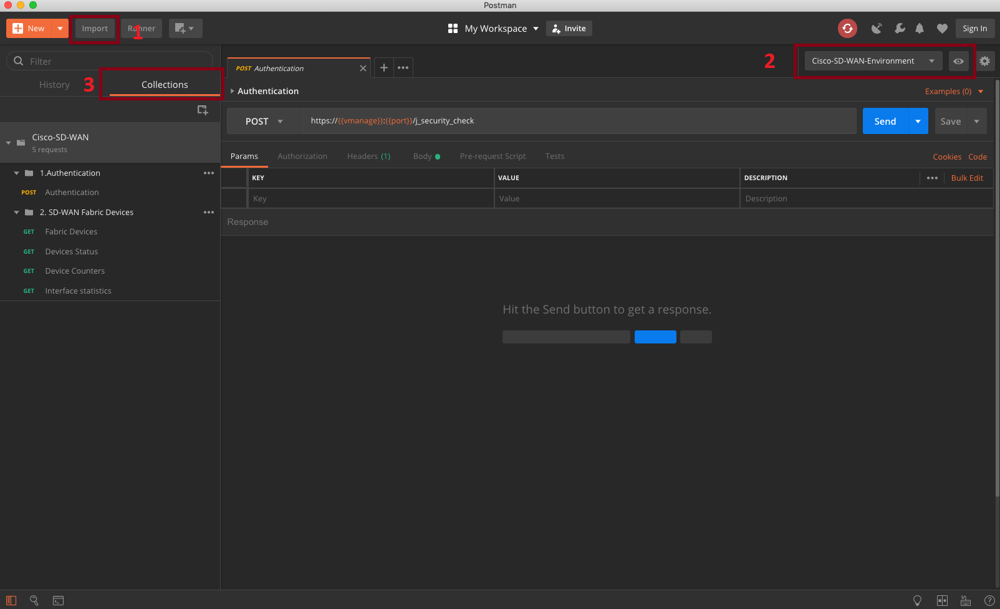
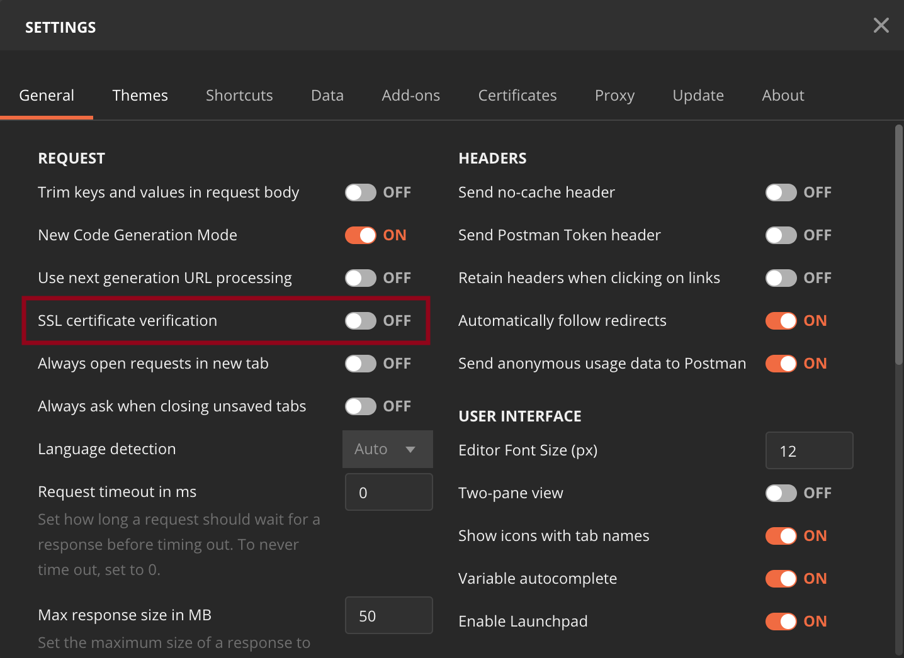

# Postman for Cisco SD-WAN

This public repo contains a [POSTMAN](https://getpostman.com) environment and collection that can be used to interact with the `Cisco SD-WAN vManage REST API`. The environment is pre-configured to access the [Cisco DevNet Always On Sandbox for SD-WAN](https://devnetsandbox.cisco.com/RM/Diagram/Index/a4ab71bc-f7a0-4d63-bedb-05a051818569?diagramType=Topology) fabric. You can edit the variables in the environment to point to your own vManage instance.

## API Calls in this Collection

This collection only includes calls to read (GET) information from the environment. It does not write changes to the vManage environment. The collection provides the following REST API calls to:

- Authenticate
  - Credentials provided in the [environment](https://github.com/CiscoDevNet/Postman-for-AlwaysOn-Cisco-SD-WAN/blob/master/Cisco-AlwaysOn-SD-WAN-Env.postman_environment.json) are for the Always On environment.
    - After authenticating with a username and password, another request is required to obtain a X-XSRF-TOKEN to protect against [Cross-Site Request Forgery](https://www.cisco.com/c/en/us/td/docs/routers/sdwan/configuration/sdwan-xe-gs-book/cisco-sd-wan-API-cross-site-request-forgery-prevention.html). When using this collection the token is automatically stored in a postman environment variable and used with further requests.
- List devices that are part of the SD-WAN fabric and show device status, counters, and interface statistics for all the interfaces in the fabric.
- List device templates
- List device policy
- Bulk API requests:
  - State [Bulk State API Documentation](https://sdwan-docs.cisco.com/Product_Documentation/Command_Reference/Command_Reference/vManage_REST_APIs/Bulk_APIs/Overview_of_Bulk_API_Operations)
    - Includes an undocumented endpoint (`/dataservice/data/device/state/CEdgeInterface`) for obtaining a list of all interfaces on Cisco IOS XE Routers including i.e. Cisco ISR and also cloud hosted CSR devices.
  - Statistics [Bulk Statistics API Documentation](https://sdwan-docs.cisco.com/Product_Documentation/Command_Reference/Command_Reference/vManage_REST_APIs/Bulk_APIs/Statistics)
    - _Data lags real-time by ~20mins_
- Real-Time monitoring [Real-Time Monitoring API Documentation](https://sdwan-docs.cisco.com/Product_Documentation/Command_Reference/Command_Reference/vManage_REST_APIs/Real-Time_Monitoring_APIs)

Feel free to modify them as you see fit and to add more calls to the collection.

## Requirements

The Postman collection and environment will need:

- Postman 6.4.4+
- Cisco SD-WAN vManage 19.2.2 +

## Setup

If you don't have Postman already installed, you can download it from [here](https://getpostman.com). Once you install it, you can follow the steps below to import the collection and environment:

1. Click on `Import`, browse to the location where you cloned this repo and add the two files:
    1. `Cisco-AlwaysOn-SD-WAN-Env.postman_environment`
    2. `Cisco-AlwaysOn-SD-WAN.postman_collection.json`
2. Make sure you select the `Cisco-AlwaysOn-SD-WAN-Environment` environment
3. Expand the collection and start making REST API calls.

### Using self-signed certificate

In case your instance of vManage has a self signed certificate, you can disable `SSL certificate verification` in Postman's settings. To disable SSL certificate verification go to Settings, click on switcher as in the screenshot below:

## About me

Network Automation Developer Advocate for Cisco DevNet.
I'm like Hugh Hefner... minus the mansion, the exotic cars, the girls, the magazine and the money. So basically, I have a robe.

Find me here: [LinkedIn](https://www.linkedin.com/in/stuarteclark/) / [Twitter](https://twitter.com/bigevilbeard)
